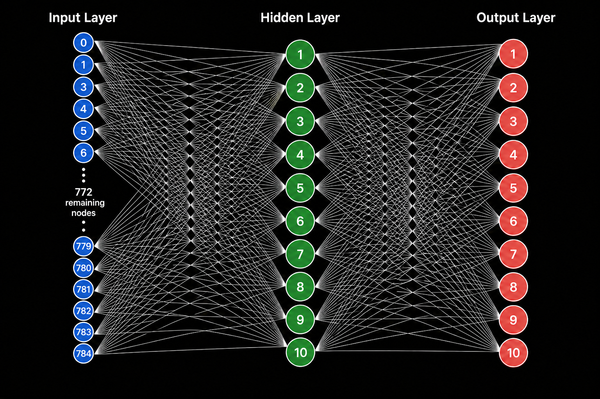

# MNIST Neural Network From Scratch

# Sentiment of this Project:
- With the growth of AI, I wanted to learn how the basic building blocks of it worked, starting with neural networks.

- I spent an entire week reviewing linear algebra as well as watching a large sum of tutorials, and lectures online regarding how such networks function.
  
- This project was created to better understand the core foundations behind neural networks and modern AI systems. This program was developed from scratch and every major function was implemented manually.

These functions are:
- Forward propagation
- Backpropagation
- Gradient descent
- ReLU activation
- Softmax activation
- One-hot encoding
- Parameter updates

# MNIST Dataset 
- This neural network is trained on the MNIST handwritten digit dataset which contains 70,000 images which are 28 by 28 pixels each.

---

# Project Motivation/ Resources

AI has always been a field that fascinates me and I wanted to learn its core fundamental i.e. the neural networks. I figured I'd develop such networks from scratch since I learn best by applying the knowledge I learn.

Before building this project, I spent time reviewing:

- Linear Algebra
- Matrix multiplication
- Partial derivatives
- Calculus 1
- Calculus 2

This project follows concepts learned from online lectures, tutorials, and educational resources, especially content from Samson Zhang.

---

# Result of This Neural Network

- With a learning rate of 0.1 and 1000 iterations, our accuracy was on average 88.39%

- Initially the models accuracy increased rapidly, but as we progressed through more itterations, the rate our accuracy got better decreased. A small explanation to why the rate of increase dropped is because at first the model knows of NOTHING so the amount that needed to be changed was HUGE and as we train the model more with more iterations, LESS needs to be altered each time.

---

# Limitations of This Neural Network

- Having only one hidden layer is a big limitation for this network.
- Having only 10 neurons in the hidden layer is also a limitation.

## Overall Explanation of the Limitations
- If we have more layers and more neurons in the hidden layer, we have more parameterswe can tweak and change. The more parameters we have, the more room for change we have. Its like having a basic car that turns roughly v.s a more complex car that turns more smoothly.

## How to Improve accuracy
- Increase the number of hidden layers.
- Increase the number of neurons per hidden layer.

---
# Neural Network Architecture

```text
Input Layer  -> Hidden Layer -> Output Layer
784 Neurons     10 Neurons      10 Neurons
```
---
# Demonstration/Verification of Model

## Neural Network Visualization



---

## Demo Video

Click the image below to watch the demo video.

[](Neural_Network_Demo.mp4)
---
# How To Run This Project

This project was developed and executed using the Kaggle notebook environment.

---

## Step 1 — Create a Kaggle Notebook

Open Kaggle and create a new notebook.

---

## Step 2 — Upload the Python File

Upload the neural network Python file into the notebook environment.

Example:

```text
Neural_Network_main.py
```

---

## Step 3 — Attach the Dataset

Inside the Kaggle notebook:

- Press **Add Input**
- Search for:

```text
Digit Recognizer
```

- Attach the dataset to the notebook

The dataset path used in this project is:

```python
/kaggle/input/competitions/digit-recognizer/train.csv
```

---

## Step 5 — Install Required Libraries

This project uses:

```text
NumPy
Pandas
Matplotlib
```

Note: Kaggle notebooks already include these libraries by default.

---

## Step 6 — Run the Program

Run the Python script or notebook cells.

The network will:

- Load and normalize the MNIST dataset
- Initialize neural network parameters
- Perform forward propagation
- Perform backpropagation
- Update parameters using gradient descent
- Print prediction accuracy during training

---

## Notes

- This implementation was intentionally built from scratch using only NumPy.
- No machine learning frameworks such as TensorFlow or PyTorch were used.
- The project is designed primarily for educational purposes and to better understand the mathematics behind neural networks.
